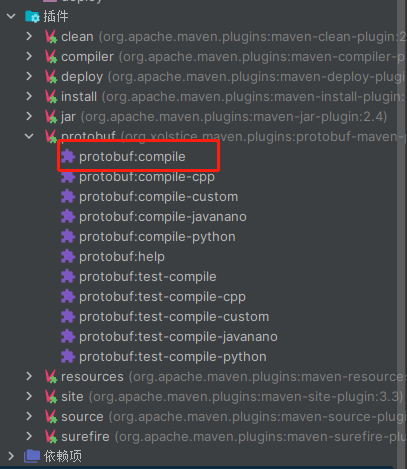

# Sujay-Proxy
一个内网穿透工具

实现思路

请求 -> 代理服务器 -> 代理客户端将消息转发给真实服务器

真实服务器反馈给代理客户端 -> 代理客户端转发消息给代理服务器 -> 代理服务器返回响应

代理服务器部署在可通过外网访问的服务器上，客户端部署在需要代理服务的服务器上

代理服务器与代理客户端保持长链接，并做心跳检测


### 快速开始
```shell
mvn protobuf:compile

mvn install
```
可以使用idea的maven插件进行安装


